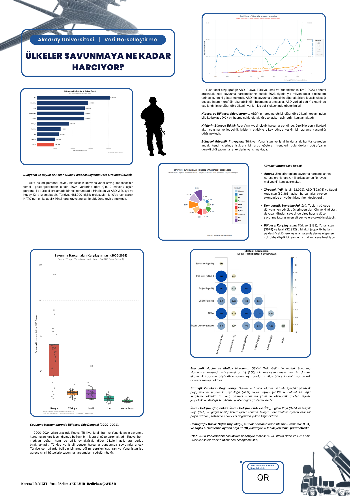

<h1 align="center">Küresel Güç Dengesi: Savunma Harcamaları Veri Görselleştirme</h1>

  <strong>Aksaray Üniversitesi · Veri Görselleştirme Dersi</strong> 
  Danışman: Doç. Dr. Volkan Soner Özsoy

  
  
  

  <a href="https://yusakru.github.io/asu-savunma-harcamas--veriGorsel/"><strong>Siteyi aç (index.html)</strong></a> ·
  <a href="./assets/images/afis.png"><strong>Afiş (PNG)</strong></a>

---

## Özet

Bu depo; SIPRI askeri harcama verileri ile Dünya Bankası (WDI) sosyoekonomik göstergelerini birleştiren **güncel korelogram analizini** (`ggcorrplot`, Spearman), afişte yer alan **çubuk, boxplot, sıçrama (dumbbell)** ve diğer çıktıları ve **güncel afiş görselini** içerir.

**Canlı sayfa:** https://yusakru.github.io/asu-savunma-harcamas--veriGorsel/

> GitHub Pages için: Repository **Settings → Pages** bölümünde kaynak olarak `main` / root (`/`) seçildiğinden emin olun. Statik site kök dosyası [`index.html`](./index.html) olmalıdır.

---

## Dijital afiş

  

---

## Üretilmiş grafikler

Tümü [`assets/images/charts/`](./assets/images/charts/) altında:

| Dosya | Açıklama |
| :--- | :--- |
| `cubuk_askeri_personel.png` | En büyük 10 askeri güç (GFP 2024) |
| `boxplot_savunma.png` | Seçili ülkeler savunma harcaması dağılımı (SIPRI, 2000–2024) |
| `sipri_dumbbell_2014_2022.png` | Savunma % GSYH sıçraması 2014 → 2022 |
| `dumbbell_savunma_sicramas.png` | Savunma % GSYH sıçraması 2014 → 2024 |
| `korelogram_8v_tum.png` | Korelogram — tüm korelasyon değerleri |
| `korelogram_8v_secici.png` | Korelogram — yalnızca p < 0.05 |

---

## Veri

| Konum | İçerik |
| :--- | :--- |
| [`data/SIPRI-Milex-data-1949-2024_2.xlsx`](./data/SIPRI-Milex-data-1949-2024_2.xlsx) | SIPRI Milex (analizde kullanılan sürüm) |

Ek göstergeler **World Bank WDI** üzerinden betik içinde çekilir (`WDI` R paketi).

---

## R betikleri

| Dosya | Açıklama |
| :--- | :--- |
| [**`rstudio/korelogram_8degisken.r`**](./rstudio/korelogram_8degisken.r) | **Güncel ana analiz:** ~40 ülke, SIPRI 2022 + WDI, Spearman, iki PNG çıktısı → `assets/images/charts/` |
| [`rstudio/korelagram.r`](./rstudio/korelagram.r) | Eski örnek (5 ülke, `corrplot`) — referans |

Çalıştırma: RStudio’da çalışma dizinini `rstudio/` yapın; veri yolu `../data/...` olarak ayarlıdır.

---

## Metodoloji özeti

- **Korelogram:** Spearman sıra korelasyonu; anlamlılık için `p < 0.05` sürümü ayrı PNG olarak üretilir.
- **Değişkenler:** Savunma (% GSYH, kişi başı log, bütçe payı), sağlık/eğitim (% GSYH), kişi başı GSYH (log), yaşam beklentisi.

---

## Hazırlayanlar

- Kerem Efe Yiğit  
- Bedirhan Çavdar  
- Yusuf Selim Akdemir  

---

  Son güncelleme: afiş ve grafikler proje klasörü ile senkronize edilmiştir.

